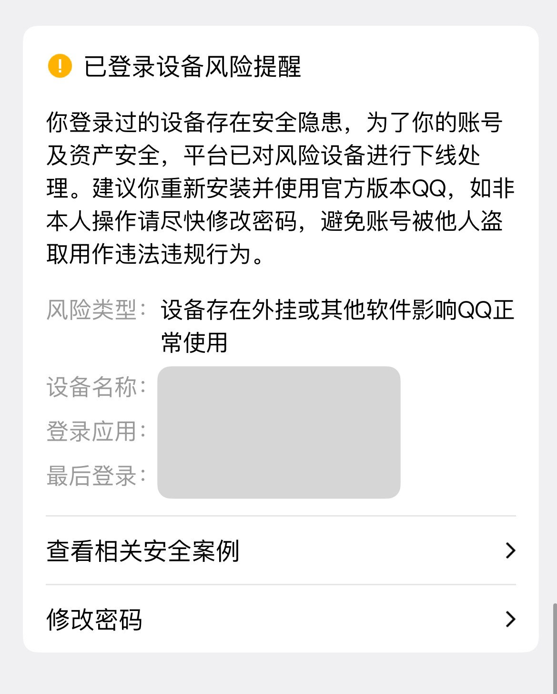

# 暂停更新说明

  

如图所示，在使用聊天记录导出工具 [shuakami/qq-chat-exporter](https://github.com/shuakami/qq-chat-exporter) 时，遇到了强制下线的问题。

在做一些尝试（如更换系统、设备）之后，发现依然会被强制下线。推测可能是账号的问题——更换小号后，不再出现上述问题。

我原期望让小号进群继续每天收集聊天记录，原始账号留在群里聊天使用。但小号申请进群后很久没有被同意，与群主沟通后得到不支持的回复。后面再次申请进群，被针对性踢出。

  

由于每日手动导出聊天记录带来一定的时间与精力成本，所以决定日报暂时停止运行。

---

如果你想自行部署运行，可以参考 [部署与使用指南](./deploy-guide.md)。
